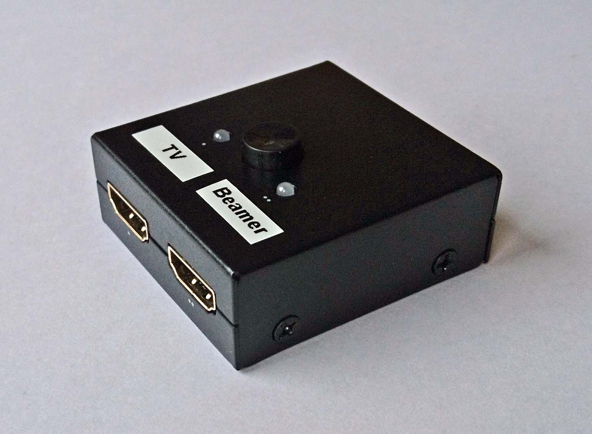
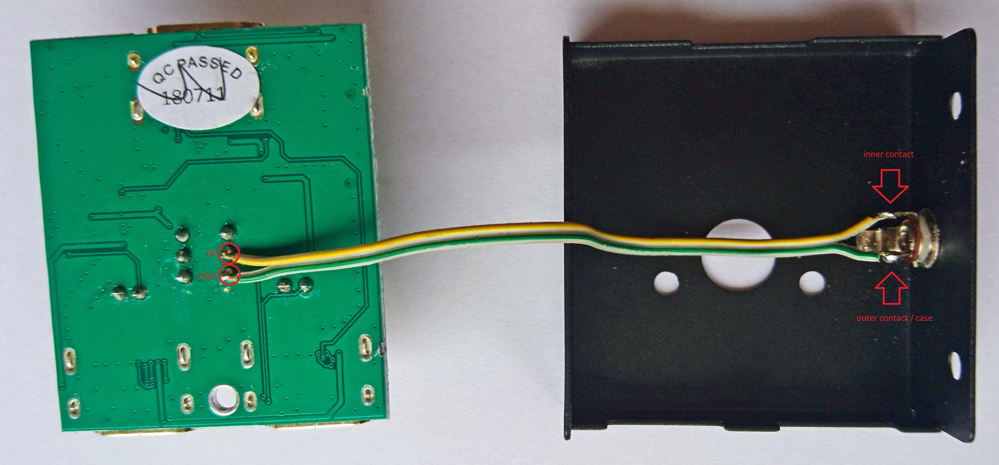
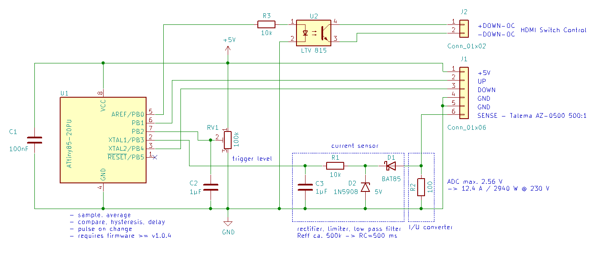
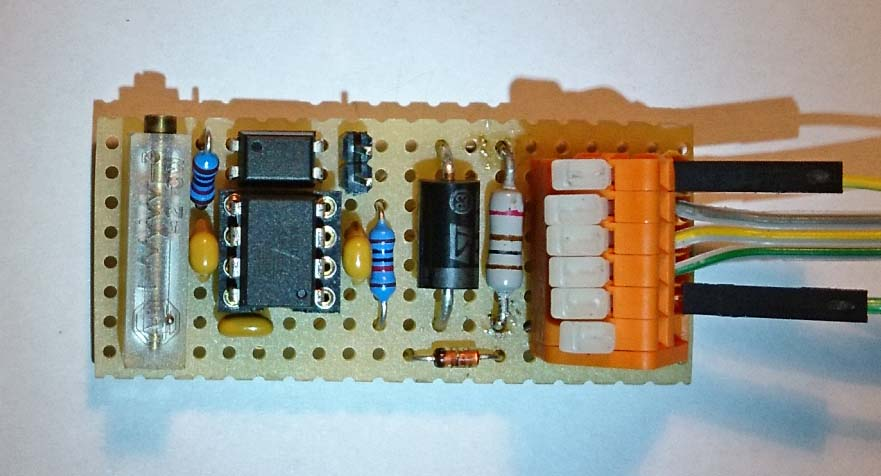

## Remote control upgrade for a manual HDMI switch

If you prefer to change your multimedia output device depending on the situation (e.g. choose between a projector and a TV) you will probably use a HDMI switch. Depending on your setup this HDMI switch is operated manually and you already wondered if you should get yourself a better model a with remote control.

With a little bit of luck you don't need to. There are quite a lot of HDMI 1:2 switches around that are operated with a mechanical push button and powered via the HDMI input cable. Many of these HDMI switches even look the same and only differ in their branding. Its is a valid assumption that some of them have the same internal circuit or at least work in a similar way. 

The next two paragraphs will describe how to modify such a HDMI switch to make it remote controlled and how to combine it with the Projection Screen Trigger. The extra components required cost around 3 EUR.

### Modifying the HDMI switch

Before I go into details please note that by following this description you void the warranty of your HDMI switch and you might damage any of the connected HDMI devices permanently. You do this at on your own risk - I do not assume any responsibility.

First check if your HDMI switch can be upgraded by performing the following tests:

- you can open the case, preferably by removing screws
- there is some spare room inside of the case where you can attach e.g. a 2.5 mm mono audio jack socket
- the push button is soldered to the PCB using through-holes
- only one contact of the push button is in use (check PCB layout and use an Ohmmeter)

You can confirm the last aspect by setting the push button to its open state and short circuit the respective pins of the push button on the PCB. This test can only be performed in a conclusive way with the input and output devices connected and turned on.

If the test was successful take a soldering iron, attach 2 wires to the 2 pins of the push button and connect it to the new audio jack socket. If you have a metal case and use an non isolated audio jack socket where the outer contact becomes directly attached to the case you must check the polarity of the push button pins. If one of the push button pins is ground and this ground is connected to the case then you must connect the ground pin with the outer contact of the audio jack socket. If you are not sure about this use a fully isolated audio jack socket or some other type of fully isolated socket.

That's all. Your HDMI switch can now be controlled remotely. You just need to short circuit the end of a cable that you attach to the audio jack.

### Modifying the Projection Screen Trigger

Sitting in your favourite cinema chair surrounded by a heap of remote controls with a new cable added on top to toggle the HDMI switch is probably not your idea of how it should work. Using pin 5 of the ATtiny85 will do the trick. With a few extra lines of code and defining `OUT_STATE` this pin will go high when the projection screen is down. The difference to the already existing *down* output is that the new output does not pulse but keeps its state like a master/slave power strip does. To be on the safe side and to avoid ground loops add an optocoupler between pin 5 and the HDMI switch remote control cable.

Only 12 holes are needed on the perfboard for the 3 new components. To connect the output of the optocoupler U2 to the HDMI switch the end of a 2.5 mm audio jack cable can be soldered to a 2 socket header. In a redesign I suggest to use a 8 pin variant for J1.

The main disadvantage of this addon to the Projection Screen Trigger is that the power consumption will rise by approximately 2.5 mW while the projection screen is down because of the current necessary to drive the optocoupler. This is a huge amount compared to the 40 µW average power consumption of the remaining circuit. Omitting the optocoupler because of its power consumption is not a good idea though because connecting 2 different circuits directly that are not designed for this purpose may result in damage to the circuits and in some cases even have the risk of electric shock. It might be possible to lower the additional power consumption somewhat by adding a step down voltage converter between U1 and R3 to power the optocoupler input. But even with the additional 2.5 mW the risk of overloading the power supply of your projection screen control unit is still very low if you decided to tap into it.