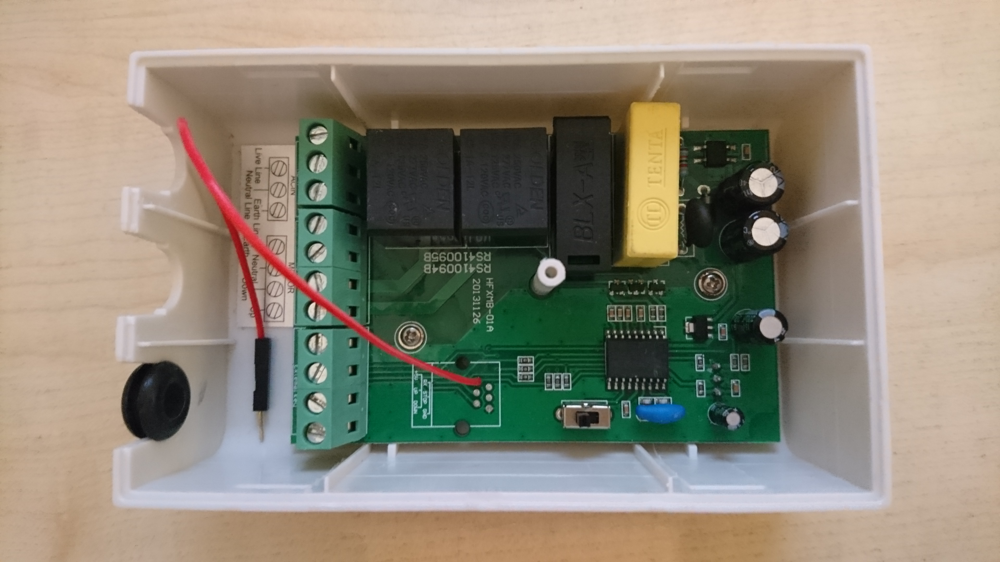

# ATtiny85 Projection Screen Trigger - Automatically control a motorized projection screen 

After looking at current commercial solutions to lower and raise a projection screen automatically I was astonished by the typical price tag for such a simple function. All it takes is to automatically press the down button when the projector is turned on and the up button when the projector is turned off. The most complicated part is to know when the projector is on or off.

To raise the bar at least a little bit, the following additional aspects came to mind:

- no direct interfacing with mains power
- no additional power supply
- lowest possible power consumption

##### No direct interfacing with mains power

This is easy - it just takes a current transformer, converting the current on the secondary side to a voltage using a resistor, rectifying the AC voltage using a diode, limiting possible over voltage using an TVS diode and add a RC low pass filter to reduce the AC ripples - 6 components total for a galvanically isolated mains current sensor. The current transformer is placed around the line wire of an extension cord that powers the projector.

##### No additional power supply

For this you need to be lucky. The control unit of a Celexon Electric Professional Plus Screen works internally with 5 V and has an unused welding hole in the PCB where it can be tapped:

Additionally the control unit has screw terminals for "up", "down" and "stop" that can be operated with a relais or with an open collector output. The case of the control unit has enough spare room to hold all components of the projection screen trigger.

##### Lowest possible power consumption

Saving power is not a strict requirement to make this project work but it is always a good idea - and an ATtiny85 is the perfect playground for power saving experiments. For a projection screen trigger you need to monitor the output voltage of the current sensor. If it gets higher than a given threshold you need to pulse the "down" output, if it gets lower the "up" output. This could be done with some analog components but the ATtiny85 does it all at once and still has nothing to do. The net result is a standby power consumption of 40 µW so that tapping into the power supply of another circuit will do no harm. Alternatively it would run on a 1500 mAh battery for 3 months.

##### Price

The components for this project cost less than 20 EUR, discounting the assembly work and excluding the ISP, with the current transformer being the most expensive part.

---

### Firmware

The firmware for the ATtiny85 could be created with [Microchip Studio](https://www.microchip.com/en-us/development-tools-tools-and-software/microchip-studio-for-avr-and-sam-devices). But if you already have an [Arduino IDE](https://www.arduino.cc/en/software/) up and running this is the better choice for a small project such as this. Just add "[ATtinyCore](https://github.com/SpenceKonde/ATTinyCore)" using the Board Manager and you can start. The required board settings are described at the beginning of the INO file.

The code itself uses C++ 11 language, in Arduino style with a static instance, because it improves the code structure slightly. Technically C++ is not necessary because there is only one object to manage.

Wherever possible the code uses high level functions provided by ATtiny Core (e.g. pin configuration and pin I/O) or the AVR toolchain (e.g. power management) because it makes the code more readable. But for using the timers or disabling the watchdog reset it was necessary to use AVR register operations. There are some good examples to be found on the web about timer and watchdog usage but to get a better understanding for this and other aspects of the microcontroller you should take the time to delve deep into [Atmel's datasheet for the ATtiny85](https://ww1.microchip.com/downloads/en/DeviceDoc/Atmel-2586-AVR-8-bit-Microcontroller-ATtiny25-ATtiny45-ATtiny85_Datasheet.pdf).

Uploading the firmware to the ATtiny85 can be a bit tricky. If you do not have an ATtiny ISP at hand you can use an Arduino instead. It doesn't matter much what kind of Arduino it is - only that the SPI wiring fits. My preference for this is a Pro Micro clone because of its built-in USB interface and the fact that no extra capacitor is needed:

 There are many tutorials around that cover this subject. You might start at [Adrduino.cc](https://create.arduino.cc/projecthub/arjun/programming-attiny85-with-arduino-uno-afb829) or [ATtinyCore](https://github.com/SpenceKonde/ATTinyCore/blob/master/Programming.md). Use the Arduino "Blink" example to test the ISP.

### Schematic

The general function of the circuit has already been explained above. It is similar to a master slave power strip but with 2 major differences:

- the sense input is galvanically isolated
- instead of a single stateful output there are 2 pulsed outputs

With RV1 you can change the trigger level without the need to change the program. You can omit RV1 and C2 if you supply a fixed value in the program instead.

Additional infos regarding the dimensioning of the circuit can be found at the beginning of the INO file. If your mains voltage is not 230 V you should modify the constant `WATTS_PER_ADC_BIT` in the code and depending on your requirements also R2.

### PCB

For prototyping I typically start with a breadboard. Then, to get fast results, I skip the PCB design and use a perfboard with thread wire. This is a great advantage if further changes are needed or new ideas come up. In most cases the electrical and mechanical properties of the perfboard are more than good enough for continuous operation.

### Wiring

At this point a **WARNING** to all electronic enthusiasts. The main difference between a commercial product and this project is that here you need professional electrical skills to properly connect the components. Do not try this project on your own if you are no expert on this subject! Your try may **COST LIFES** if you make a mistake. You may only use this project **AT YOUR OWN RISK**. I will not assume any responsibility and I will not provide photos of a suitable assembly solution.

- Connect the 5 V DC power supply output to pins 1 (+5 V) and 4 (GND) of J1.

- Connect the current transformer to pins 5 and 6 of J1. The polarity is not relevant because of the AC input.

- The connection of the output pins 2 (UP) and 3 (DOWN) together with 4 (GND) of J1 depend on the control unit of your projection screen. You *must* research this aspect *before* committing to this project:

  - If the control unit has external inputs (galvanically isolated or switching when connected to GND) you can connect the outputs directly.

  - If the control unit has user buttons for up and down that connect to GND you can connect the outputs in parallel to the user buttons.

  - In all other cases you need to find your own solution. Depending on the requirements you can invert the outputs or use optocouplers.

- Place the current transformer around the line wire of an extension cord to the projector.

  - If you have enough spare room in the case of the control unit of the projection screen you might try to fit in all components. For this you could cut off the plug from the extension cord to the projector, run the open end of the cable through a cable entry into the control unit case and connect it to the mains input on the inside. With the outer cable isolation off on the inside of the case you can thread the still isolated line wire through the current transformer. If the wire gauge of the cable powering the control unit is too low to supply the projector and the projection screen motor at the same time it must be replaced with a suitable one to prevent *cable burning*.

- Make sure that everything is properly isolated and that all cables leaving the case have a strain relief before powering up.

- Check that a manual override of the projection screen motor direction via the control unit is still possible.

## Contributing

In you want something clarified or improved you may raise an [issue](https://github.com/jnsbyr/attiny-projection-screen-trigger/issues).

## Licenses and Credits

#### Documentation, Photos and Schematic

Copyright (c) 2020 [Jens B.](https://github.com/jnsbyr)

The schematic was created using [KiCad](https://kicad.org/).

The badges in this document are provided by [img.shields.io](https://img.shields.io).

#### Firmware

Copyright (c) 2020 [Jens B.](https://github.com/jnsbyr)

The firmware was build using the [Arduino IDE](https://www.arduino.cc/en/software/).

The firmware source code depends on:

#### ATtiny Core

Copyright (C) 2015 [ATtinyCore Project](https://github.com/SpenceKonde/ATTinyCore#license)

#### AVR GCC Toolchain

Copyright (C) 2009 [Free Software Foundation, Inc.](https://fsf.org/)

## Sponsoring

If you like this project, please consider sponsoring me. Note that while this is a nonprofit open source project I am not part of a registered nonprofit organisation so there will be no tax deduction for you.

